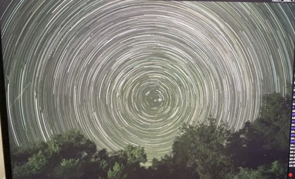

# Star Trail Useful Scripts

A collection of Python scripts for processing star trail photography images.

## Results

### Polaris Alignment Comparison
Before alignment (notice Polaris movement):



After alignment (Polaris fixed in center):


### Animated Star Trail
Example output from the GIF creation script:


## Scripts

### alignPolaris.py
Star-trail Polaris alignment tool that performs translation-only alignment of star trail frames.

**Features:**
- Automatically solves the first frame using astrometry.net to locate Polaris
- Template matching to track Polaris across all frames
- Translation-based alignment to center Polaris in all frames
- Outputs aligned 16-bit PNG frames ready for stacking
- Filters out low-quality frames based on matching scores
- Detailed CSV logging of alignment metrics

**Workflow:**
1. Solves only the first frame to get Polaris pixel coordinates
2. Builds a template around Polaris from the reference frame
3. Template-matches in each subsequent frame to find drift
4. Applies translation corrections to align Polaris
5. Computes common crop area from good frames only
6. Saves aligned, cropped frames as 16-bit PNGs

### cumulative2gif.py
Creates optimized GIFs from sequential star trail images with size optimization features.

**Features:**
- Loads image sequences from glob patterns
- Downscales images to reduce file size
- Frame subsampling (keeps every Nth frame)
- Palette quantization for smaller file sizes
- Optional MP4 conversion using ffmpeg
- Configurable FPS and quality settings

## Requirements

Install the required Python packages:

```bash
pip install -r requirements.txt
```

## Usage

### alignPolaris.py

1. Get an API key from https://nova.astrometry.net
2. Edit the script to set your `ASTROMETRY_API_KEY`
3. Prepare your input directory structure:
   
   **Input folder structure:**
   ```
   frames_in/
   ├── IMG_0001.jpg
   ├── IMG_0002.jpg
   ├── IMG_0003.jpg
   └── ...
   ```
   
   Supported formats: RAW (.CR2, .NEF, .ARW, etc.), JPEG, PNG, TIFF, FITS

4. Run the script:

```bash
python alignPolaris.py
```

**Output files:**
- `frames_aligned/` - Aligned 16-bit PNG frames (compatible with StarStaX software)
- `frames_bad/` - Low-score frames (for inspection)
- `polar_align_log.csv` - Detailed alignment metrics

### cumulative2gif.py

1. Prepare your input directory with processed star trail images:
   
   **Input folder structure:**
   ```
   cumulative/             # Output from StarStaX software (required)
   ├── cumulative_001.png  # Progressive star trail images
   ├── cumulative_002.png  # from StarStaX stacking process
   ├── cumulative_003.png
   └── ...
   ```
   
   Supported formats: PNG, JPEG, TIFF
   
   **Note:** This script requires cumulative images from StarStaX, not individual aligned frames.

2. Edit the script to configure your input pattern and settings
3. Run the script:

```bash
python cumulative2gif.py
```

## Configuration

Both scripts include configuration sections at the top of the files where you can adjust:

- Input/output directories
- Processing parameters
- Quality settings
- File formats and patterns

## Dependencies

- **numpy**: Numerical operations
- **opencv-python**: Image processing and template matching
- **rawpy**: RAW image processing
- **astropy**: Astronomical coordinate systems and FITS handling
- **astroquery**: Astrometry.net API interface
- **imageio**: Image I/O operations
- **Pillow (PIL)**: Image processing for GIF creation

Optional dependencies:
- **ffmpeg**: For MP4 conversion (system dependency)

## Notes

- The alignment script requires an internet connection for the first frame solving
- Large image sequences may require significant processing time
- Ensure sufficient disk space for output files
- Both scripts are designed to handle various image formats commonly used in astrophotography